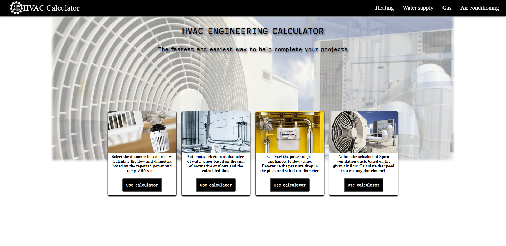

# HVAC-Calculator

As an environmental engineering graduate, I figured I'd create an online calculator that helps with the tedious portion of creating an HVAC project. 
This particular app allows its users to calculate the pipe/air duct diameters and sizes in 4 different specializations 
(Heating, Ventilation, Water supply, and gas supply). The tech stack used to build this app: HTML, CSS, and JavaScript.

### How to use the app
1. Download the files
2. Run the index.html
3. Select the calculator which you want to use
4. Input the required data for the calculator to work its magic

### User features
* Gas pipe calculator - The user can use the gas calculator to determine the gas flow or appliance power depending on which value was inputted. 
Besides this, the calculator returns an array of nominal pipe diameters that can be used at this section of the project along with the pressure 
drops and gas flow speed [m/s].

* Heating pipe calculator - The user can use the heating calculator to determine the pipe diameter for a specific water flow or the heating unit's power. 
The user can also switch between different fluid types used in the project and enter his temperatures which influence the calculations of the diameters.

* Water pipe calculator - The user can use the water supply calculator to determine the combined water flow [l/s] in the building, the calculative water 
flow, the pipe diameter, and the speed of the water flow by inputting the number of water fixtures inside the building/room.

* Ventilation calculator - The user can use the air conditioning calculator to determine the air duct diameter (round or square) by 
inputting the required airflow.

# The user UI:

### HVAC calculator - Main page

### HVAC calculator - Gas calculator

### HVAC calculator - Calculated Gas

### HVAC calculator - Heating calculator

### HVAC calculator - Calculated Heat

### HVAC calculator - Water supply calculator

### HVAC calculator - Calculated Water supply

### HVAC calculator - Ventilation calculator

### HVAC calculator - Calculated Ventilation

